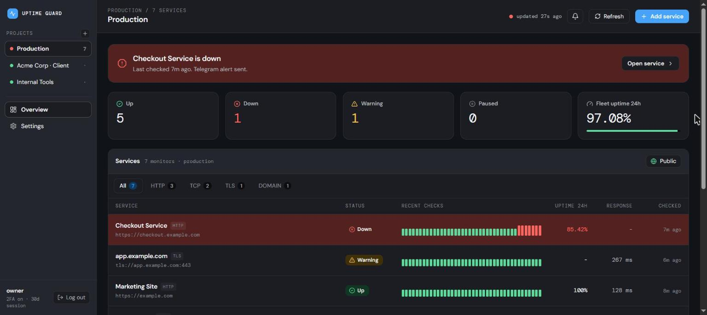
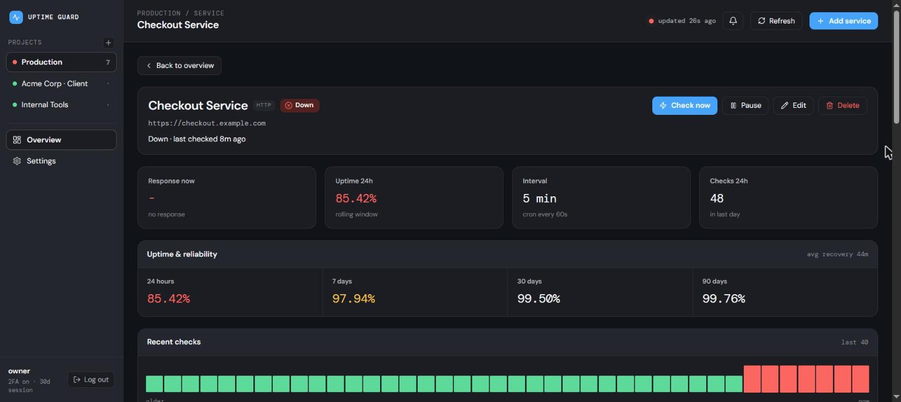
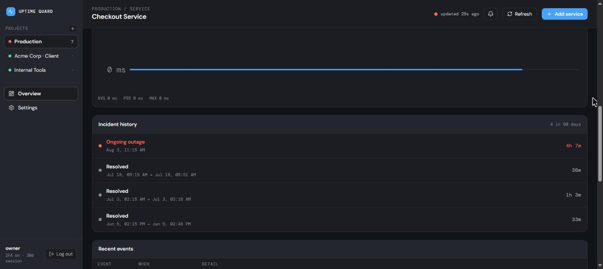
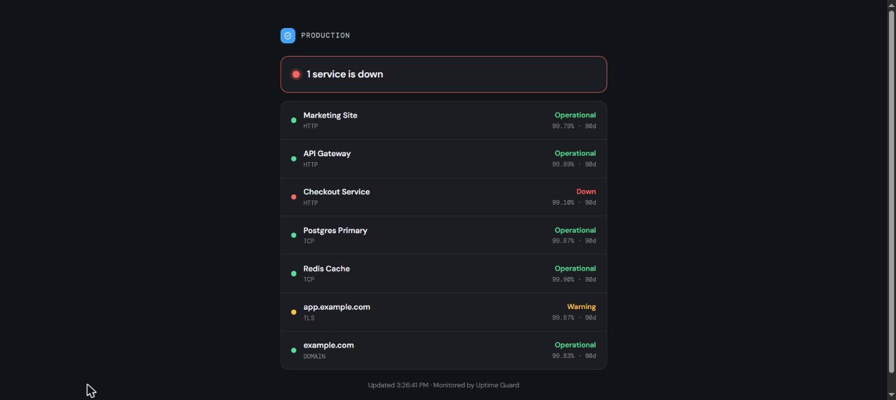

<div align="center">

# 🛡️ Uptime Guard

**Self-hosted uptime monitoring that runs entirely on Cloudflare's free tier.**

Monitor websites, APIs, TCP ports, DNS, TLS certificates, domain expiry and cron jobs —
with a fast dashboard, escalating alerts, public status pages, and desktop push notifications.

[](./LICENSE)
[](https://workers.cloudflare.com/)
[](./CONTRIBUTING.md)

### [▶ Live demo](https://vigil-demo.calmray.team) &nbsp;·&nbsp; password `demo` &nbsp;·&nbsp; [Public status page](https://vigil-demo.calmray.team/status/demo)



</div>

---

## Why Uptime Guard?

Most uptime tools are SaaS you pay per-monitor for, or heavyweight apps you have to host on a
server that itself needs monitoring. Uptime Guard runs on a **Cloudflare Worker + D1** — no
server to babysit, and comfortably inside the **free tier** for dozens of monitors. A minute's
cron does the checks; a single self-contained React app is the dashboard; alerts reach you on
Telegram and as desktop push even when the tab is closed.

- ⚡ **Serverless & free** — Worker (cron) + D1 (SQLite). No VPS, no bill for a small fleet.
- 🔐 **Locked down** — password **+ TOTP** login, rate-limiting, session revocation.
- 📟 **Alerts that escalate** — Telegram + Web Push, with backoff re-alerts while still down.
- 📊 **Real reliability data** — 24h / 7d / 30d / 90d uptime, incident history, MTTR.
- 🌐 **Public status pages** — share a read-only page per project, no login.
- 📱 **Installable PWA** — add to your desktop/phone; push works with the app closed.

## Features

| | |
|---|---|
| **6 monitor types** | HTTP(S), TCP port, DNS record, TLS certificate expiry, domain (registrar) expiry, and heartbeat (dead-man's switch) |
| **Smart checks** | Keyword & JSON-field assertions, status-range matching, and **retry-burst confirmation** so a single blip never pages you |
| **Escalating alerts** | Telegram + Web Push on down/recovery, with widening re-alerts (5m → 10m → 20m → 40m → hourly) and total-downtime on recovery |
| **Reliability metrics** | Per-service 24h/7d/30d/90d uptime from daily rollups, incident timeline, and mean-time-to-recovery |
| **Public status pages** | Opt-in per project, edge-cached, sanitized (names + status + uptime only — never URLs/IPs) |
| **PWA + desktop push** | Installable app, service worker delivers notifications when fully closed |
| **Cloudflare-aware TLS** | Detects CF-fronted hosts and shows a non-alerting "CF Protected" state instead of false downs |
| **Polished UX** | Path routing, deep links, pagination, live status, sound alerts, light/dark, mobile-first |

## Screenshots

<div align="center">

| Service detail — SLA windows & MTTR | Incident history |
|:--:|:--:|
|  |  |
| **Public status page** — shareable, no login | |
|  | |

</div>

## Quick start

You need a (free) [Cloudflare account](https://dash.cloudflare.com/sign-up) and Node 18+.

### 1. Clone & configure

```bash
git clone https://github.com/CalmRay-Solutions/uptime-guard.git
cd uptime-guard
cp worker/wrangler.toml.example worker/wrangler.toml
```

### 2. Create the database

```bash
cd worker
npm install
npx wrangler login
npx wrangler d1 create uptime-guard      # paste the printed database_id into wrangler.toml
npm run db:init:remote                    # create the schema on the remote D1
```

### 3. Set your login secrets

```bash
npm run auth:setup    # prints a TOTP secret + QR; scan it into Google Authenticator/Authy
npx wrangler secret put PASSWORD          # your login password
npx wrangler secret put TOTP_SECRET       # the base32 secret from the step above
npx wrangler secret put SESSION_SECRET    # any long random string
```

### 4. (Optional) Telegram + Web Push alerts

```bash
# Telegram — create a bot via @BotFather, then:
npx wrangler secret put TELEGRAM_BOT_TOKEN
npx wrangler secret put TELEGRAM_CHAT_ID
# Web Push — generate a VAPID keypair (see docs) then set VAPID_PUBLIC / VAPID_PRIVATE / VAPID_SUBJECT
```

### 5. Build & deploy

```bash
cd ..
npm run deploy        # builds the dashboard and deploys the Worker (which serves it)
```

Wrangler prints your URL (e.g. `https://uptime-guard-worker.<you>.workers.dev`). Open it, sign
in with your password + authenticator code, create a project, and add your first monitor. Checks
start within 60 seconds.

> **Custom domain:** uncomment the `routes` block in `wrangler.toml` to serve the dashboard on
> your own domain (must be on the same Cloudflare account).

## Architecture

```
┌────────────────────────┐        every 60s        ┌──────────────────┐
│  Cloudflare Worker      │ ── scheduled() cron ──▶ │  runs due checks  │
│  • REST API (/api/*)    │                         │  http/tcp/dns/tls │
│  • serves the SPA       │ ◀── records results ──  │  domain/heartbeat │
│  • Telegram + Web Push  │                         └──────────────────┘
└───────────┬────────────┘
            │ binds
      ┌─────▼─────┐   ┌──────────────────────────────┐
      │  D1 (SQL) │   │  React + Vite dashboard (SPA) │
      │  projects │   │  served from the same Worker  │
      │  services │   │  password + TOTP auth         │
      │  checks   │   └──────────────────────────────┘
      │  incidents│
      │  rollups  │
      └───────────┘
```

- **`worker/`** — Cloudflare Worker: REST API, a `scheduled()` cron (per-minute checks + a daily
  rollup/prune job), Telegram + Web Push, and it serves the built dashboard via the assets binding.
- **`dashboard/`** — React + Vite single-page app (hand-rolled CSS, embedded fonts, inline icons —
  no runtime CDN). Talks to the Worker over the REST API with a signed session token.

## Monitor types

- **HTTP(S)** — fetch a URL, assert the status range, optionally that the body contains / omits a
  keyword or that a JSON field equals a value.
- **TCP Port** — open a raw socket to `host:port` (via `cloudflare:sockets`). SSH, Postgres, SMTP,
  game servers, anything.
- **DNS record** — resolve A/AAAA/CNAME/MX/TXT/NS over DNS-over-HTTPS, optionally asserting the value.
- **TLS certificate** — hand-rolled TLS 1.2 handshake, parses the served cert's `notAfter`, warns
  before expiry. Cloudflare-fronted hosts show a non-alerting **CF Protected** state.
- **Domain expiry** — registrar expiry via RDAP, warns before it lapses.
- **Heartbeat** — a dead-man's switch. Your cron job hits a unique `/ping/<token>` URL each run; no
  ping within the grace window flips it down.

## Alerts

- **Telegram** — fires on every up→down and down→up, plus certificate/domain expiry warnings.
  Escalating re-alerts while a service stays down, and total downtime on recovery.
- **Web Push** — installable PWA + service worker deliver desktop notifications **even when the app
  is closed**. Clicking one opens the affected service.
- **In-tab** — sound alarm/chime and a tab-title badge while the dashboard is open.

## Security

- Password **+ TOTP** (authenticator) login; HMAC-signed session tokens.
- Login **rate-limiting** with a progressive delay and a hard lockout after repeated failures.
- **Session revocation** — sign out every other device in one click.
- Public status pages are sanitized: names, status and uptime only — never targets, IPs, or config.

See [SECURITY.md](./SECURITY.md) to report a vulnerability.

## Limitations & roadmap

Being honest about the trade-offs:

- **Single owner** — one operator account, no multi-user/teams yet.
- **Runs on Cloudflare** — if Cloudflare itself has an outage, checks pause. A redundant external
  runner is the natural phase 2.
- **Telegram + Web Push only** — email / Slack / Discord and maintenance windows are on the roadmap.

Ideas and PRs for any of these are very welcome.

## Contributing

Issues and pull requests are welcome — see [CONTRIBUTING.md](./CONTRIBUTING.md). Good first areas:
extra alert channels, additional monitor types, and tests for the check/TLS/TOTP logic.

## License

[MIT](./LICENSE) © CalmRay
